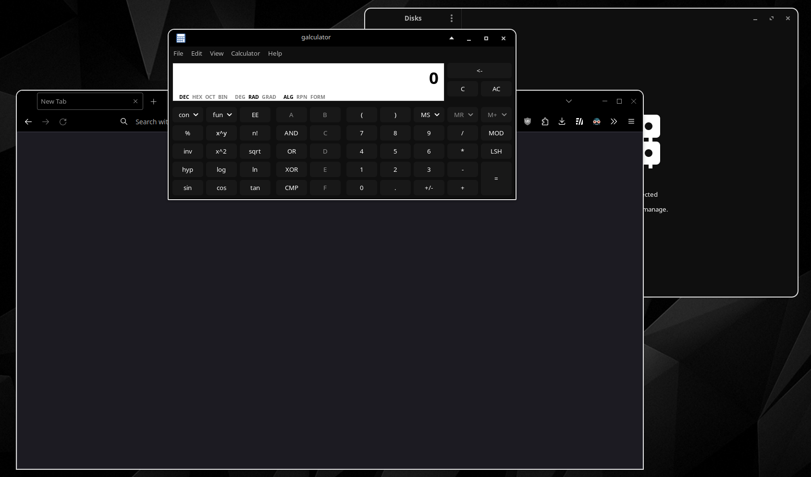
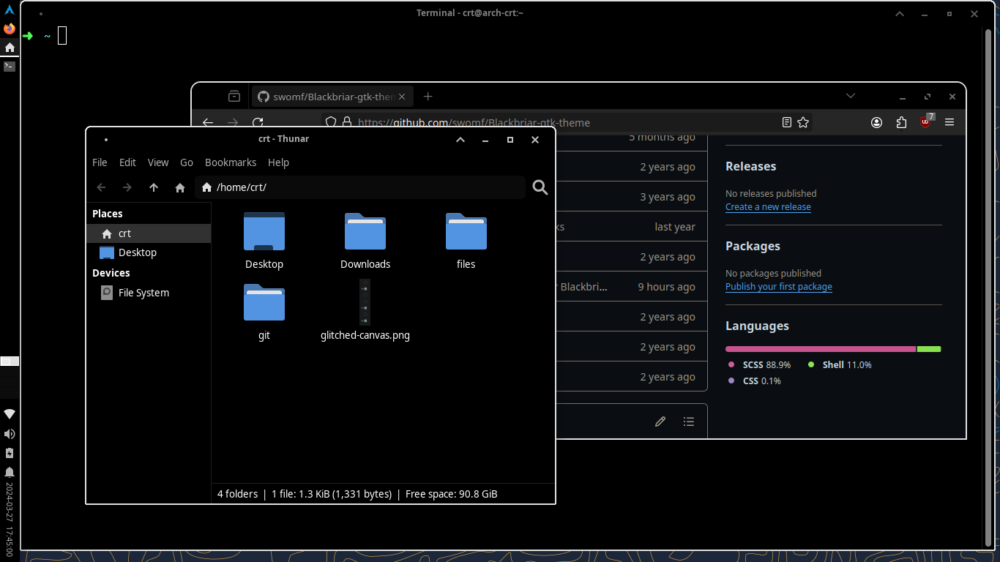

# Blackbriar GTK theme

A black-background white-outline GTK theme. Meant to match
[Blackbriar KDE theme](https://github.com/swomf/Blackbriar-kde-theme).

## Previews

### KDE 6



### XFCE 4



- `Wallpapers` [Graphite Wallpapers](/wallpaper)

## Installation

Ensure that GTK >= 3.20 and `sassc` are installed.  
The [Papirus](https://github.com/PapirusDevelopmentTeam/papirus-icon-theme) icon theme is recommended.

```bash
# use sudo if system-wide installation is desired
./install.sh
```

Run `install.sh --help` for more information.
